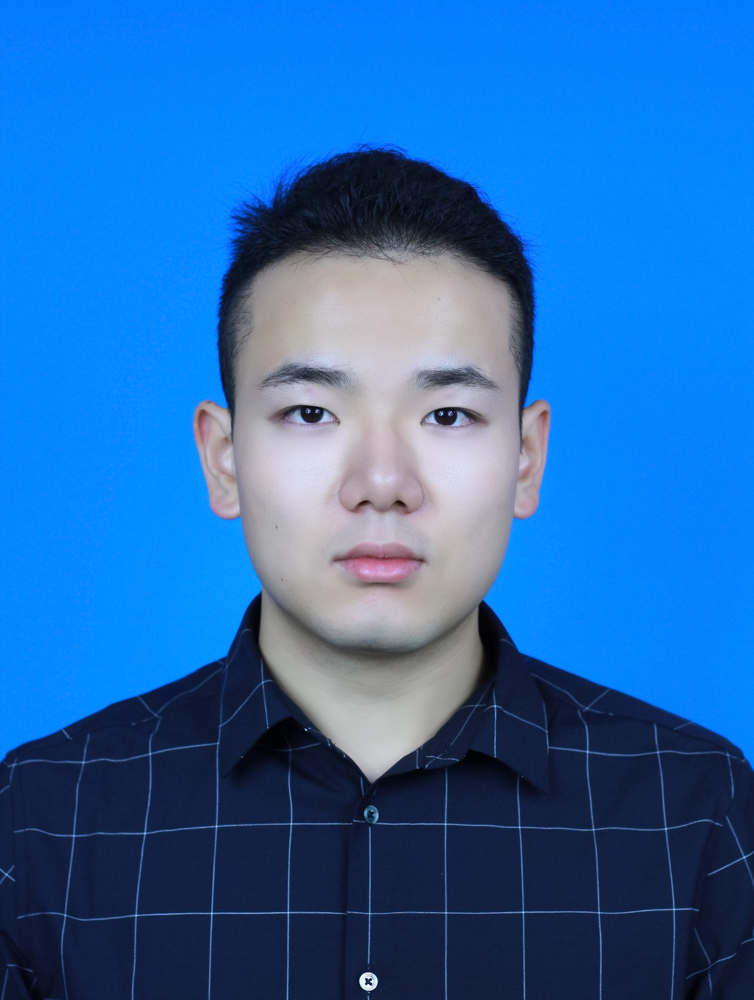

## Wenhui Lei

University of Electronic Science and Technology of China (UESTC), Sichuan, China

(86) 19983488202丨wenhui.lei@std.uestc.edu.cn

Git: [https://github.com/LWHYC](https://github.com/LWHYC)

### Research Interests
-	Medical Image Analysis
-	Complex Network
-	Computer Vision
-	Image Guided Intervention

### Publications
-	**Lei, W.**, Mei, H., Sun, Z., Ye, S., Gu, R., Wang, H., Huang, R., Zhang, S., Zhang, S. and Wang, G., Automatic Segmentation of Organs-at-Risk from Head-and-Neck CT using Separable Convolutional Neural Network with Hard-Region-Weighted Loss, **Neurocomputing**, 2020 (1st round revision).
-	**Lei, W.**, Wang, H., Gu, R., Zhang, S., Zhang, S. and Wang, G.. "DeepIGeoS-V2: Deep Interactive Segmentation of Multiple Organs from Head and Neck Images with Lightweight CNNs."  **MICCAI Workshop LABELs(oral)**, pp. 61-69, 2019.
-	**Lei, W.**, Mei, H., Gu, R., Zhang, S., Zhang, S. and Wang, G., Thoracic Organs-at-Risks Segmentation using Learnable Intensity Transform and Centroid Distance Regression (under revision).
-	Mei, H., **Lei, W.**, Gu, R., Ye, S., Sun, Z., Zhang, S. and Wang, G., Automatic Segmentation of Gross Target Volume of Nasopharynx Cancer using Ensemble of Multiscale Deep Neural Networks with Spatial Attention, **Neurocomputing**, 2020 (accepted).
-	Zhai, S., Gu, R., **Lei, W.**, and Wang, G., "A Weighted Ensemble Coarse-to-fine Framework for Myocardial Edema and Scars Segmentation" **MICCAI Workshop MyoPS**, 2020 (accepted).
-	Liu, Z., Wang, H., **Lei, W.**, Wang, G.. "CSAF-CNN: Cross-Layer Spatial Attention Map Fusion Network for Organ-at-Risk Segmentation in Head and Neck CT Images." **ISBI**, pp. 1522-1525, 2020.
-	Wang, H, Wang, G., Xu, Z., **Lei, W.**, Zhang, S.. "High-and Low-Level Feature Enhancement for Medical Image Segmentation." **MICCAI Workshop MLMI**, pp. 611-619, 2019.

### Challenges

- [StructSeg 2019 challenge](http://www.structseg-challenge.org/#/): 
    - Won the 3rd place in MICCAI 2019 Automatic Structure Segmentation for Radiotherapy Planning (StructSeg) Challenge task 1 (head and neck organ). The method is mainly composed of:
      1. Segmental Linear Functions (SLFs) transform the intensity of CT images to make multiple organs more distinguishable than existing methods. 
      2. A novel 2.5D network specially designed for dealing with clinic H&N CT scans with anisotropic spacing. 
      3. Our proposed attention to hard voxels (ATH) uses a voxel-level hardness strategy, which is more suitable to dealing with some hard regions despite that its corresponding class may be easy. 
      The paper describing above methods is under revision of Neurocomputing (IF=4.438).
    - Won the 2nd place in StructSeg task2 (head and neck tumor): The method is mainly composed by: 
      1. Cropping data in large and small image mode for ensemble of features in different scales. 
      2. A variant of the U-Net, in which each block was preceded by a ‘Project Excite’ (PE) block. It can recalibrate feature maps spatial-wisely on 3D volumetric images. 
      The paper describing above methods is accepted by Neurocomputing.
- [MyoPS 2020 challenge](http://www.sdspeople.fudan.edu.cn/zhuangxiahai/0/MyoPS20/):
    - Won the 1st place in MICCAI 2020 Myocardial Pathology Segmentation Combining Multi-sequence CMR Challenge: Proposed a weighted ensemble coarse-to-fine framework for myocardial edema and scars segmentation. It consists of:
        1. Coarse-to-fine model which first predict the cardiac structure area and then output a detailed prediction.
        2. A weighted ensemble model to integrate prediction from 2D network and 2.5D network.
- [ABCs 2020 challenge](https://abcs.mgh.harvard.edu/):
    - Won the 2nd place in MICCAI 2020 Anatomical Brain Barriers to Cancer Spread (ABCs) Challenge task 1: segmenting 5 brain structures to use for automated definition of the clinical target volume (CTV) for radiotherapy treatment.
    - Won the 2nd place in MICCAI 2020 ABCs task 2: segmenting 10 structures to use in radiotherapy treatment plan optimization.

### Education
- University of Electronic Science and Technology of China (UESTC), Sichuan, China
    - Master of Computer Vision and Image Processing, 2018.09 – 2021.07 (Expected)
- University of Electronic Science and Technology of China (UESTC), Sichuan, China
    - Bachelor of Industrial Engineering, 2014.09 – 2018.09
    
### Research Experience
- Healthcare Intelligence Lab of UESTC, 2018.2 – Present
    - Advisor: Pro. Shaoting Zhang, Pro. Guotai Wang and Pro. Kang Li
- Robotics Research Center of UESTC, 2016.10 – 2017.8
    - Advisor: Pro. Lu Liang, Pro. Hong Cheng, UESTC
    - Research: Simulation of Spiking Neural Networks (SNN) and their Memristor-CMOS hardware implementations.
- Institute of Reliability Engineering of UESTC, 2015.7 – 2016.10
    - Advisor: Pro. Yu Liu, UESTC
    - Research: Basic knowledge of Deep Learning and Machine Learning.

### Markdown

Markdown is a lightweight and easy-to-use syntax for styling your writing. It includes conventions for

```markdown
Syntax highlighted code block

# Header 1
## Header 2
### Header 3

- Bulleted
- List

1. Numbered
2. List

**Bold** and _Italic_ and `Code` text

[Link](url) and 
```

For more details see [GitHub Flavored Markdown](https://guides.github.com/features/mastering-markdown/).

### Jekyll Themes

Your Pages site will use the layout and styles from the Jekyll theme you have selected in your [repository settings](https://github.com/LWHYC/LWHYC.github.io/settings). The name of this theme is saved in the Jekyll `_config.yml` configuration file.

### Support or Contact

Having trouble with Pages? Check out our [documentation](https://docs.github.com/categories/github-pages-basics/) or [contact support](https://github.com/contact) and we’ll help you sort it out.
